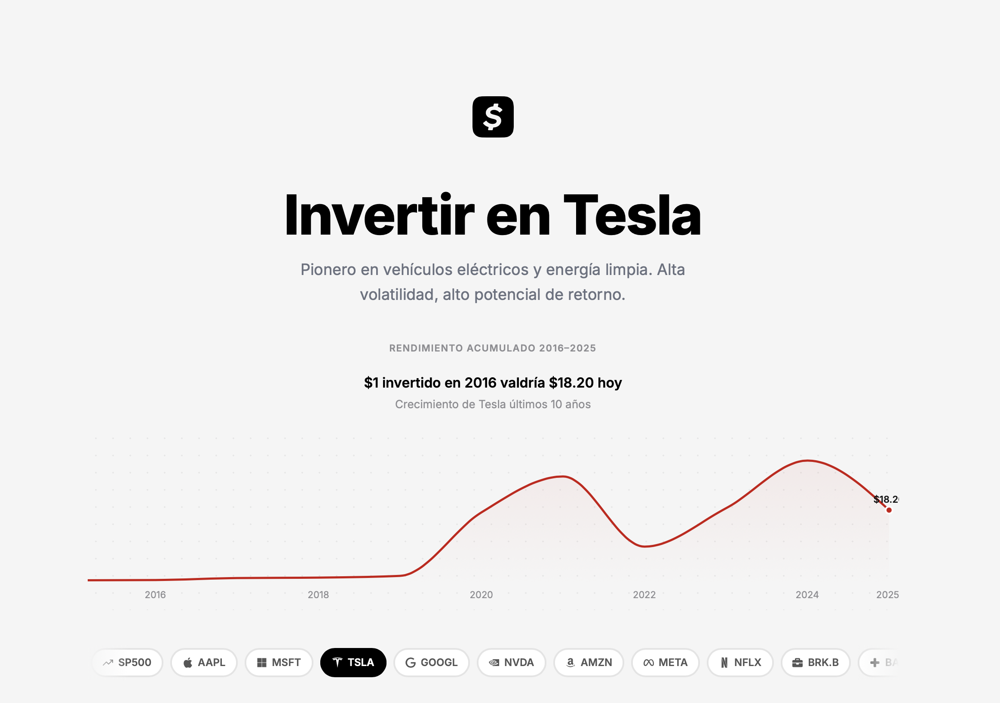

# 💸 Calculadora de Inversión S&P 500 + Stocks


*Calculá cuánto necesitás aportar mensualmente para alcanzar tu objetivo de inversión, con proyecciones reales del S&P 500 y stocks individuales.*



🌐 [Ver app en vivo](https://sp500-calculadora.vercel.app)

---

## ✨ Features

- 📊 **Calculadora de aportes mensuales** con interés compuesto (fórmula PMT)
- 📈 **11 activos disponibles**: S&P 500, Apple, Microsoft, Tesla, Alphabet, Nvidia, Amazon, Meta, Netflix, Berkshire Hathaway y Bayer
- 🎯 **5 modos de tasa**: MIN (conservadora), AVG (promedio 10 años), MAX (mejor año histórico), 2026 (proyección de analistas) y Manual
- 💾 **Persistencia local** de cálculos guardados vía localStorage
- 📉 **Gráfico de crecimiento acumulado** por activo (2016–2025)
- 📱 **Diseño mobile-first** inspirado en Cash.app — light mode, alto contraste, foco en los números
- 🇦🇷 **Footer con apps recomendadas** para invertir desde Argentina (DolarApp, Berry, IOL, Balanz)

---

## 🛠️ Stack tecnológico

| Categoría | Tecnología | Razón |
|---|---|---|
| Framework | React 18 + Vite | Velocidad de dev y build |
| Estilos | Tailwind CSS 3 | Utility-first, rápido para iterar |
| Charts | Recharts | API simple, fácil de customizar |
| Iconos | react-icons | Logos de marcas (Apple, Meta, Nvidia…) |
| UI primitives | Radix UI (Select, Tooltip) | Accesibilidad y comportamiento correctos |
| Persistencia | localStorage | Sin backend para v1 |
| Hosting | Vercel | Deploy automático desde GitHub |

---

## 🚀 Getting started

**Requisitos:** Node 18+

```bash
# Cloná el repo
git clone https://github.com/bochenn/sp500-calculadora.git
cd sp500-calculadora

# Instalá dependencias
npm install

# (Opcional) Actualizá los íconos de las apps del footer
node scripts/fetch-icons.cjs

# Corré el dev server
npm run dev
```

Abrí [http://localhost:5173](http://localhost:5173).

---

## 📐 Decisiones de diseño

- **Light mode estilo Cash.app** — claridad, contraste alto, verde `#00D632` como acento. Los números son los protagonistas.
- **Datos hardcodeados en `/src/data/assets.js`** — sin dependencia de APIs externas ni API keys. Actualizables con datos de Yahoo Finance en un par de minutos.
- **localStorage en lugar de DB** — sin backend, deploy trivial, privacidad del usuario por defecto.
- **Carousel ↔ dropdown sincronizados** — una sola fuente de verdad (`selectedStockKey` en `App.jsx`) evita estados inconsistentes entre hero y calculadora.
- **Bayer como caso educativo** — el único activo con AVG negativo (~-16%). Muestra que el stock-picking puede salir muy mal y le da contexto real a la herramienta.

---

## 📊 Sobre los datos

> Los retornos históricos anuales son aproximaciones basadas en datos de mercado abiertos. Las proyecciones para 2026 son estimaciones de consenso de analistas y **no constituyen asesoramiento financiero**. Esta app es una herramienta educativa para entender el poder del interés compuesto, no una recomendación de inversión.

**Fórmula utilizada (PMT):**

```
PMT = FV × r / ((1 + r)^n - 1)

FV = monto objetivo
r  = tasa anual / 12
n  = años × 12
```

---

## 📁 Estructura del proyecto

```
src/
├── components/
│   ├── StockCarousel.jsx     # Hero + selector horizontal de activos
│   ├── PerformanceChart.jsx  # Area chart de crecimiento acumulado
│   ├── CalculatorSection.jsx # Calculadora inline con resultados
│   ├── CalculationsTable.jsx # Tabla/cards de cálculos guardados
│   ├── CalcDetailModal.jsx   # Modal de detalle por cálculo
│   ├── Footer.jsx            # Apps de inversión recomendadas
│   └── ui/                   # Button, AmountInput, SelectorButton,
│                             # StockSelect, InfoTooltip
├── data/
│   └── assets.js             # Definición de los 11 activos
│                             # (retornos, tasas, colores, tickers)
├── utils/
│   ├── finance.js            # PMT, formatters, computes
│   ├── stockIcons.js         # Mapa de íconos por ticker
│   └── storage.js            # localStorage helpers
├── App.jsx                   # Estado global + routing entre secciones
└── main.jsx
```

---

## 🤖 Cómo fue construido

Este proyecto fue construido íntegramente con [Claude Code](https://www.anthropic.com/claude-code), la herramienta de coding agéntica de Anthropic, en aproximadamente 12 iteraciones de diseño y desarrollo. Cada feature fue especificada en lenguaje natural, con referencias visuales (Cash.app, Mercury, Superpower) que guiaron el sistema de diseño.

---

## 📝 Licencia

MIT — usalo, forkealo, mejoralo.
